# Epitech Arcade Project
<p align="center">
  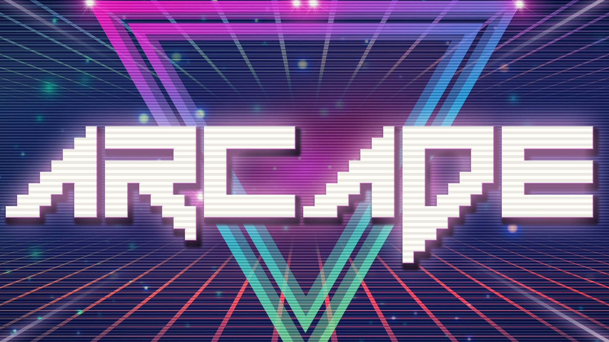
</p>

The goal of this project was to create an arcade gaming platform.<br>
This platform include two games and is able to run with three different GUIs, ncurses, sfml and OpenGl.
Games and GUIs are dynamics loaded libraries.<br>
A documentation is provided if you want to create your game or gui with our core.

## Screenshots:

# Menu :

<p align="center">
  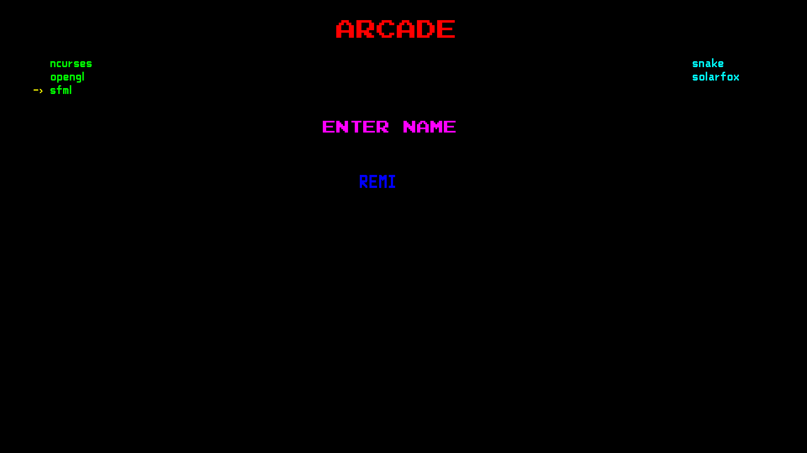 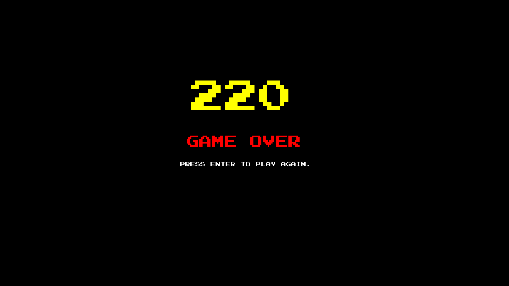<br>
  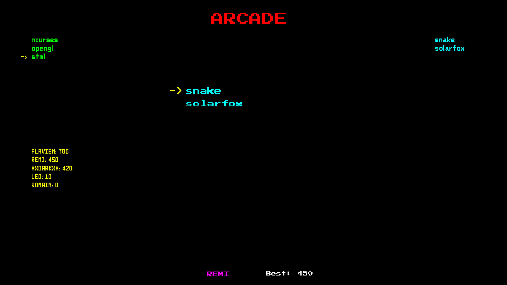 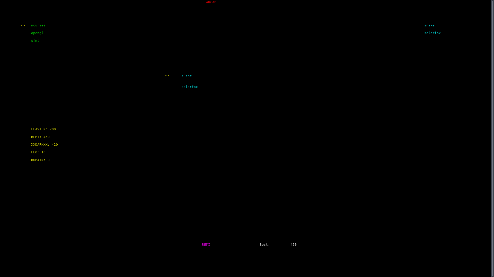
</p>

# Snake :
<p align="center">
  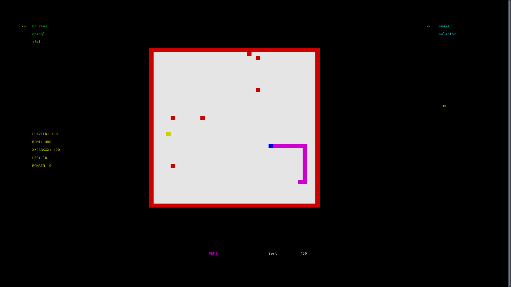 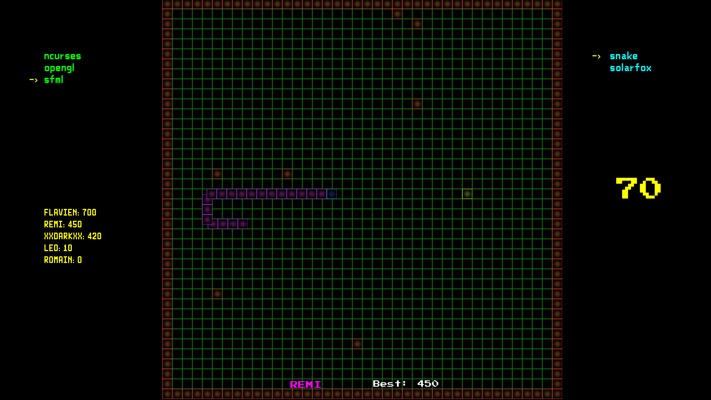<br>
  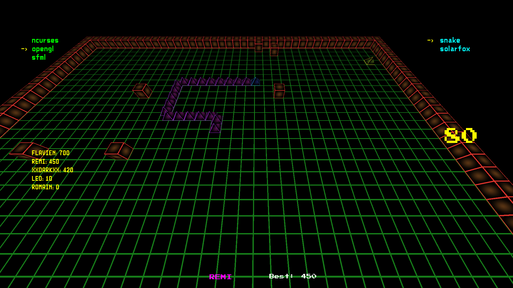
</p>

# SolarFox :
<p align="center">
  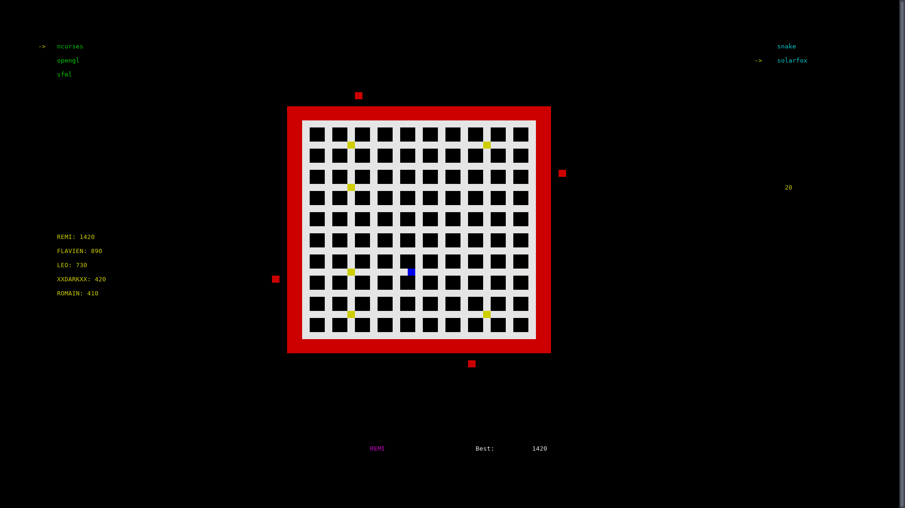 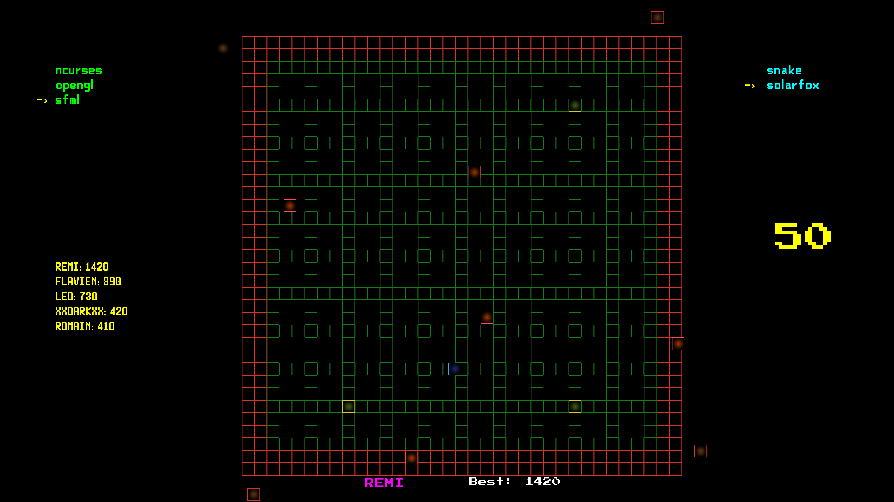<br>
  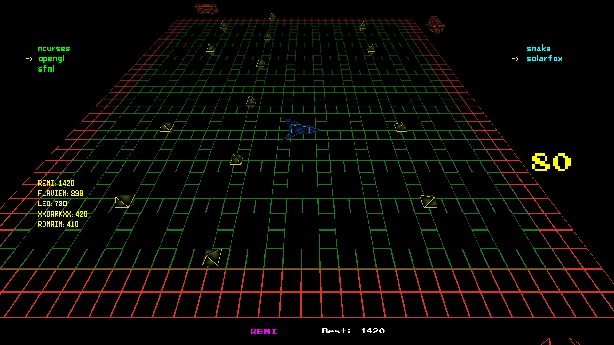 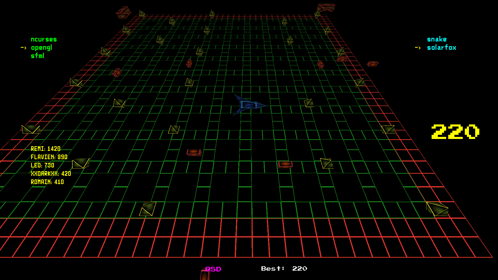
</p>


## Creators:

###### Rémi Gastaldi
```json
{
  "nom":"Gastaldi",
  "prenom":"Rémi",
  "email":"remi.gastaldi@epitech.eu",
  "linkedin": "https://www.linkedin.com/in/rémi-gastaldi-09b9a810a/"
}
```

###### Léo Hubert
```json
{
  "nom":"Hubert",
  "prenom":"Léo",
  "email":"leo.hubert@epitech.eu",
  "linkedin": "https://www.linkedin.com/in/leohubert"
}
```

###### Flavien Sellet
```json
{
  "nom":"Sellet",
  "prenom":"Flavien",
  "email":"flavien.sellet@epitech.eu",
  "linkedin": "https://www.linkedin.com/in/flavien-sellet-32254b10a/"
}
```
